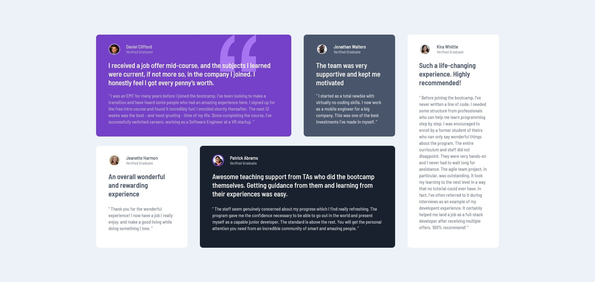

# Frontend Mentor - Testimonials grid section solution

This is a solution to the [Testimonials grid section challenge on Frontend Mentor](https://www.frontendmentor.io/challenges/testimonials-grid-section-Nnw6J7Un7). Frontend Mentor challenges help you improve your coding skills by building realistic projects. 

## Table of contents

- [Overview](#overview)
  - [The challenge](#the-challenge)
  - [Screenshot](#screenshot)
  - [Links](#links)
- [My process](#my-process)
  - [Built with](#built-with)
  - [What I learned](#what-i-learned)

## Overview

### The challenge

Users should be able to:

- View the optimal layout for the site depending on their device's screen size

### Screenshot

### Links

- Solution URL: [Testimonials Grid Section Solution](https://github.com/telsabate-hub/testimonials-grid-section)
- Live Site URL: [Testimonials Grid Section](https://telsabate-hub.github.io/testimonials-grid-section/)

## My process

### Built with

- Semantic HTML5 markup
- CSS custom properties
- Flexbox
- CSS Grid

### What I learned

I learned to use the "background-image" CSS property to set the image as a background of a div element. Then, to send the image to the back, I added "position: absolute" to it while the parent element and element at the front have "position: relative" style.

I also learned to use the "background-size" property to adjust the size of the background image.

